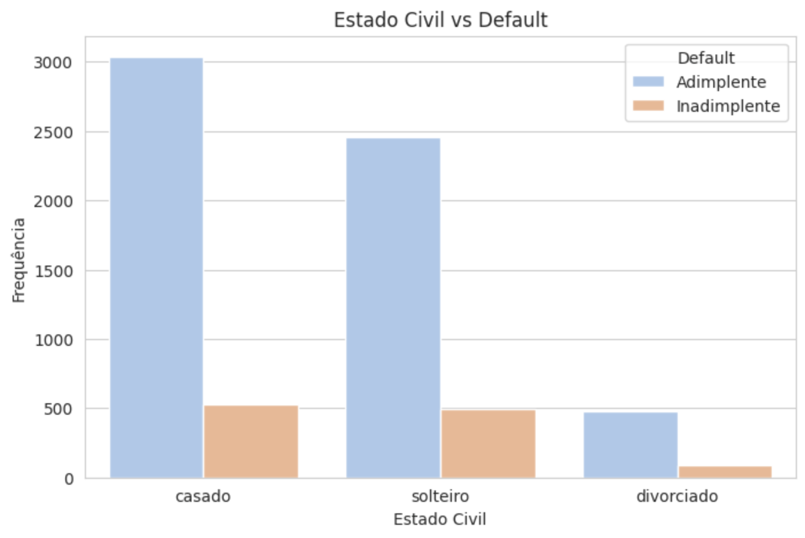

# Análise de Inadimplência de Clientes

Este projeto analisa os padrões de inadimplência em uma base de dados de clientes, destacando insights sobre estado civil, escolaridade, salário anual, e comportamento transacional. O objetivo é identificar fatores de risco e sugerir estratégias para mitigação.

---

## **Principais Insights**
1. **Proporção de Clientes Adimplentes e Inadimplentes**
   - Adimplentes: **84.28%**
   - Inadimplentes: **15.72%**

   

2. **Estado Civil e Inadimplência**
   - Solteiros têm maior inadimplência (**16.69%**).
   - Casados apresentam menor risco (**14.84%**).

   

3. **Escolaridade e Inadimplência**
   - Menor risco: Ensino Médio (**14.34%**).
   - Maior risco: Doutorado (**19.26%**).

   

---

## **Gráficos**
Os gráficos podem ser encontrados no caderno disponível [aqui](Projeto_final_ebac.ipynb).

## **Kaggle**
https://www.kaggle.com/code/danielprazeres/projeto-final-ebac
---

## **Como Executar**
1. Clone o repositório:
   ```bash
   git clone https://github.com/danielprazeres/projeto_final_python_ebac.git
   ```